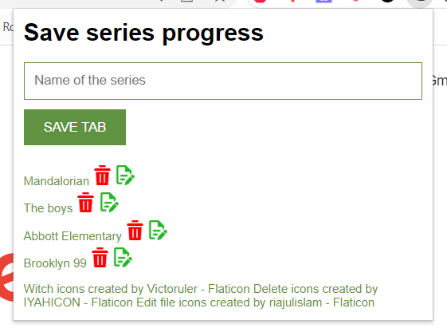

## Table of Contents
1. [General Info](#general-info)
2. [Screenshot](#screenshot)
3. [Installation](#installation)
### General Info
***
This is a simple chrome extension that saves the current tab. This is for keeping track on where you at when watching series/videos on streaming sites.
### Screenshot

## Installation
***
A little intro about the installation. 
```
$ Download folder
$ In chrome, insert chrome://extensions in navigation bar
$ Click on **Load unpacked**
$ Select the project folder
$ Activate extension if necessary
```
